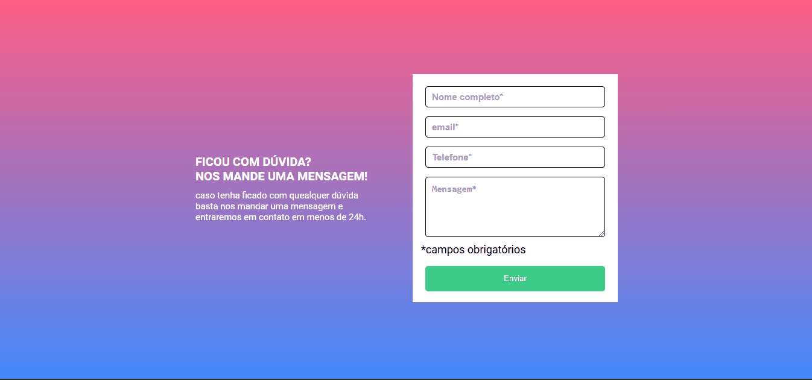

# Formulário de validação.

## Sobre o projeto

- Este projeto se trata de mais uma atividade do curso Dev Quest - FullStack do Dev em Dobro.
- É um formulário de validação que quando não tem o campo preenchido ele avisa que é obrigatório o preenchimento dos campos e os campos preenchidos corretamente ficaram com a borda verde, indicando que está tudo certo.

## Tecnologias utilizadas

1) HTML: Para a estruturação.
2) CSS : Para toda a estilização da página.
3) JavaScript : Para toda a parte de validação do formulário.

## Desafios

- Me encontrei com uma parede que foi o desconhecimento do metodo `nextElementSibling`, o que estava me fazendo cometer erros de sintaxe e o código verboso.
     - Resolução do problema: logo que me senti estancado, procurei   ajuda no suporte do curso e no chat da comunidade.